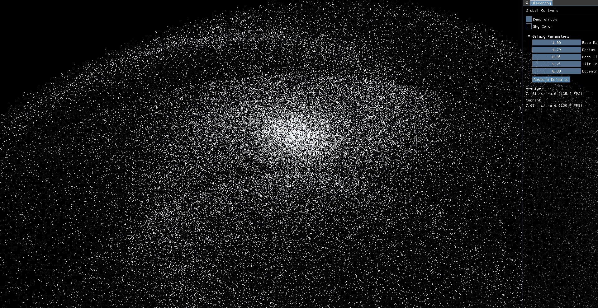
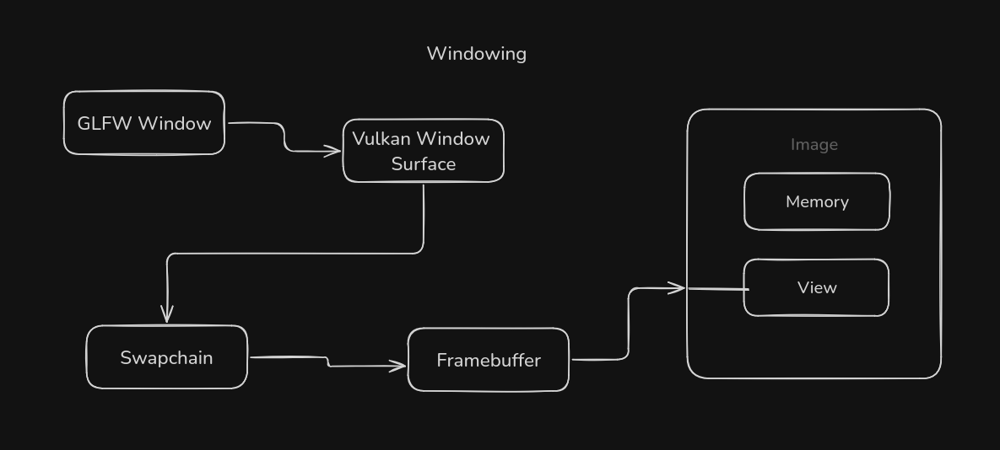
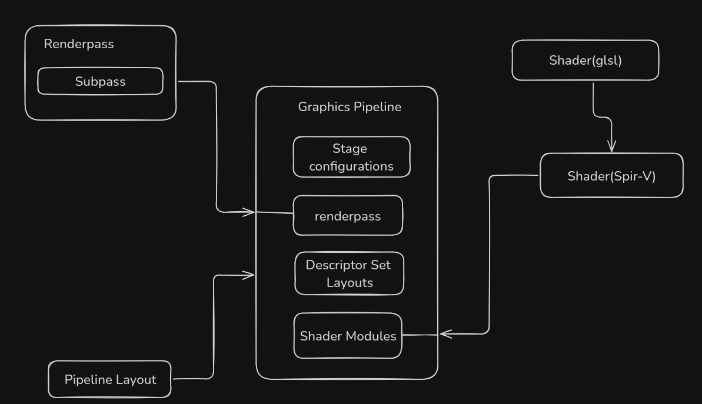
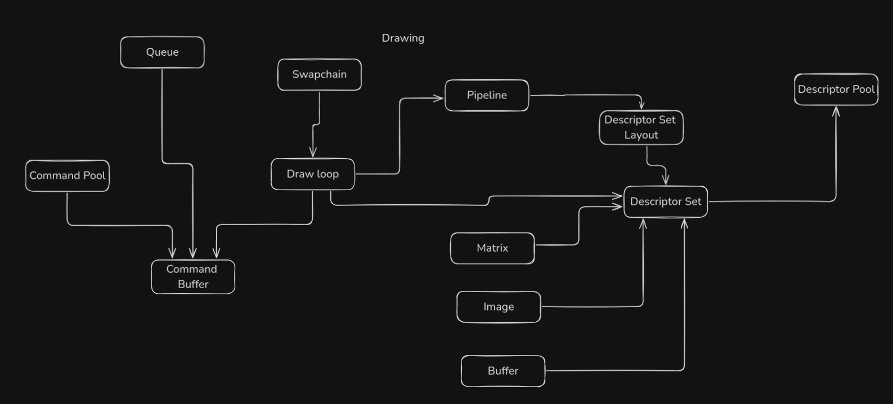

# VoxelEngine (WIP)

```This is a Rendering Engine created using the Vulkan Graphics API. The backend is finished, currently working on creating different scenes to more showcase this project.```

---
### Link to my trello board to the project organization.

## [PROJECT BOARD](https://trello.com/b/2YI795DN/voxelengine)

---

## Implementing galaxy particle system

## One-hundred-thousand


## 2 million stars rendered with average 7ms frame time




## Project Layout

### [Windowing](README/Windowing.md)



### [Graphics Pipeline](README/GraphicsPipeline.md)



### [Drawing](README/Drawing.md)



## References and Resources Used

https://beltoforion.de/en/spiral_galaxy_renderer/

[Ellipse Formula](https://www.desmos.com/calculator/qmu0f229zh)

[de Vaucouleurs's Law](https://www.desmos.com/calculator/bax4od28zj)

<!-- command to run on linux `make test` --->
