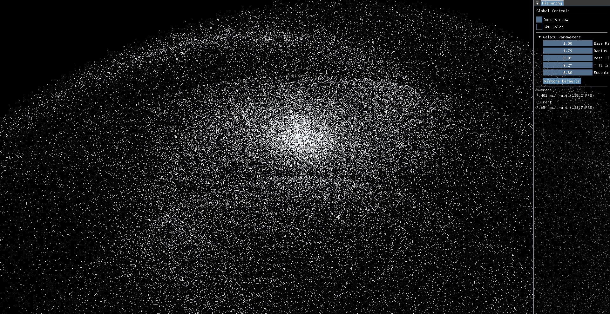
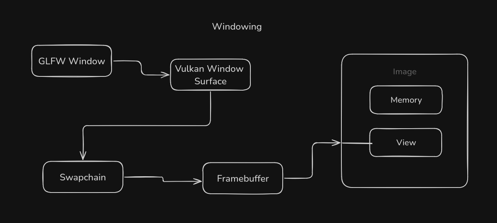
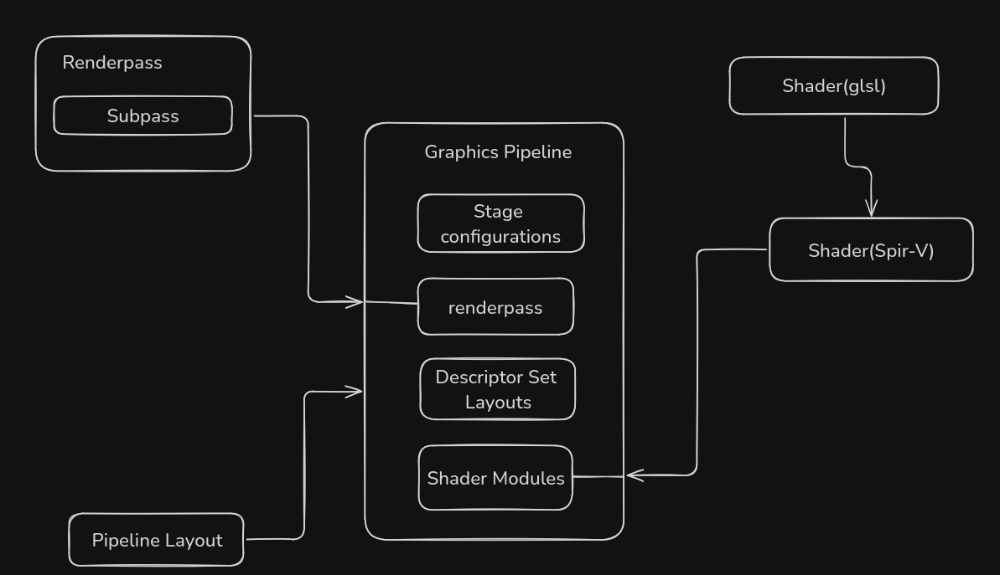
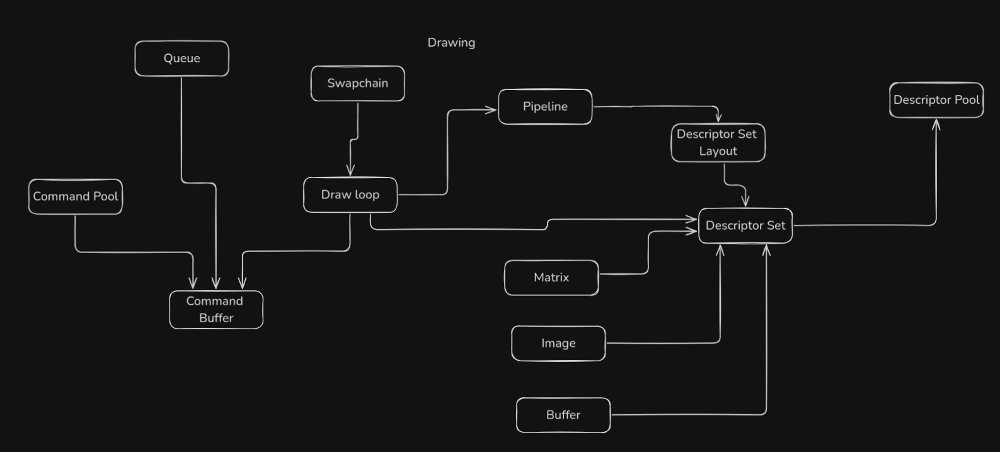

# VoxelEngine (WIP)

```This is a Rendering Engine created using the Vulkan Graphics API. The backend is finished, currently working on creating different scenes to more showcase the awesomeness of this project.```

---
### Link to my trello board to the project organization.

## [PROJECT BOARD](https://trello.com/b/2YI795DN/voxelengine)

---

## 2 million stars rendered with average 7ms frame time



## Implementing galaxy particle system (100,000 stars rendering right now)


## Project Layout

### [Windowing](VoxelEngine/README/Windowing.md)



### [Graphics Pipeline](VoxelEngine/README/GraphicsPipeline.md)



### [Drawing](VoxelEngine/README/Drawing.md)



<!-- command to run on linux `make test` --->
